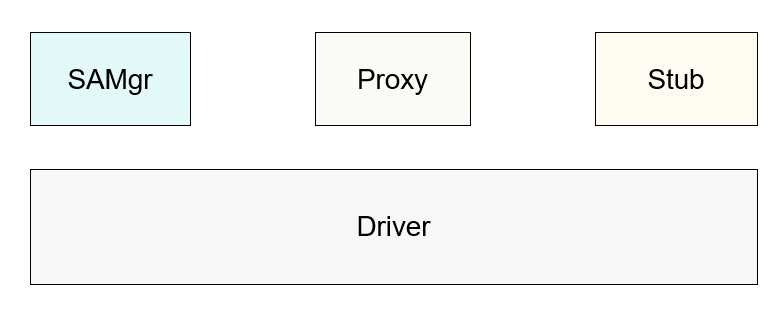

# communication\_ipc<a name="EN-US_TOPIC_0000001103602398"></a>

-   [Introduction](#section11660541593)
-   [Architecture](#section1950291414611)
-   [Directory Structure](#section161941989596)
-   [Constraints](#section119744591305)
-   [Compilation and Building](#section137768191623)
-   [Usage](#section1312121216216)
    -   [Available APIs](#section1551164914237)
    -   [Usage Guidelines](#section129654513264)

-   [Repositories Involved](#section1371113476307)

## Introduction<a name="section11660541593"></a>

The inter-process communication \(IPC\) and remote procedure call \(RPC\) mechanisms are used to implement cross-process communication. The difference between them lies in that IPC uses the Binder driver to implement cross-process communication within a device, whereas RPC uses the DSoftBus driver to implement cross-process communication across devices. IPC and RPC generally use a client-server model. The service requester \(client\) can obtain the proxy of the service provider \(server\) and use the proxy to read and write data, thus implementing data communication between processes. Generally, the server registers system abilities \(SAs\) with the system ability manager \(SAMgr\), which manages the SAs and provides APIs for the client. To communicate with a specific SA, the client must obtain the proxy of the SA from SAMgr. In this document, Proxy represents the service requester, and Stub represents the service provider.

## Architecture<a name="section1950291414611"></a>

**Figure  1**  IPC architecture<a name="fig312319321710"></a>  


## Directory Structure<a name="section161941989596"></a>

```
/foundation/communication/ipc
├── interfaces        # APIs exposed externally
│   └── innerkits     # Header files for internal subsystems
│       ├── ipc_core     # IPC APIs
│       └── libdbinder   # dbinder APIs
├── ipc            # IPC framework
│   ├── native     # IPC native implementation
│       ├── src    # IPC native source code
│       └── test   # IPC native unit test cases
│   └── test       # IPC native module test cases
├── service        # dbinder implementation
│   └── dbinder    # dbinder source code
```

## Constraints<a name="section119744591305"></a>

Currently, cross-device RPC communication is not supported.

## Compilation and Building<a name="section137768191623"></a>

**Native Dependency**

SDK dependency:

```
external_deps = [
  "ipc:ipc_core",
]
```

In addition, the refbase implementation on which IPC/RPC depends is stored in  **//utils**. Add the dependency on the Utils source code.

```
deps = [
  "//utils/native/base:utils",
]
```

## Usage<a name="section1312121216216"></a>

The procedure for implementing cross-process communication using native APIs is similar to that using Java APIs.

1.  Define an interface.

    The interface inherits  **IRemoteBroker**  and defines descriptors, functions, and message code.

2.  Implement the server provider \(stub\).

    The stub inherits  **IRemoteStub\(Native\)**  or  **RemoteObject\(Java\)**  as well as  **AsObject**  and  **OnRemoteRequest**.

3.  Implement the service requester \(proxy\).

    The proxy inherits  **IRemoteProxy\(Native\)**  or  **RemoteProxy\(Java\)**, encapsulates functions, and calls  **SendRequest**  to send requests to the stub.

4.  Register an SA.

    After the process where the service provider resides starts, apply for the unique SA ID and register the stub with SAMgr.

5.  Obtain the SA.
6.  Obtain the proxy from the SAMgr based on the SA ID and device ID, and implement cross-process communication with the stub through the proxy.

### Available APIs<a name="section1551164914237"></a>

**Table  1**  Native IPC APIs

<a name="table178849240013"></a>
<table><thead align="left"><tr id="row6884924608"><th class="cellrowborder" valign="top" width="14.12141214121412%" id="mcps1.2.4.1.1"><p id="p98846241706"><a name="p98846241706"></a><a name="p98846241706"></a>Class/Interface</p>
</th>
<th class="cellrowborder" valign="top" width="52.54525452545254%" id="mcps1.2.4.1.2"><p id="p1488482414020"><a name="p1488482414020"></a><a name="p1488482414020"></a>Method</p>
</th>
<th class="cellrowborder" valign="top" width="33.33333333333333%" id="mcps1.2.4.1.3"><p id="p388516244016"><a name="p388516244016"></a><a name="p388516244016"></a>Description</p>
</th>
</tr>
</thead>
<tbody><tr id="row15885824402"><td class="cellrowborder" valign="top" width="14.12141214121412%" headers="mcps1.2.4.1.1 "><p id="p08859241008"><a name="p08859241008"></a><a name="p08859241008"></a>IRemoteBroker</p>
</td>
<td class="cellrowborder" valign="top" width="52.54525452545254%" headers="mcps1.2.4.1.2 "><p id="p388572412010"><a name="p388572412010"></a><a name="p388572412010"></a>sptr&lt;IRemoteObject&gt; AsObject()</p>
</td>
<td class="cellrowborder" valign="top" width="33.33333333333333%" headers="mcps1.2.4.1.3 "><p id="p13885724405"><a name="p13885724405"></a><a name="p13885724405"></a>Obtains the holder of a remote proxy object. This method must be implemented by the derived classes of <strong id="b9012379013"><a name="b9012379013"></a><a name="b9012379013"></a>IRemoteBroker</strong>. If you call this method on the stub, the <strong id="b11613719015"><a name="b11613719015"></a><a name="b11613719015"></a>RemoteObject</strong> is returned; if you call this method on the proxy, the proxy object is returned.</p>
</td>
</tr>
<tr id="row138859241808"><td class="cellrowborder" valign="top" width="14.12141214121412%" headers="mcps1.2.4.1.1 "><p id="p1888515245012"><a name="p1888515245012"></a><a name="p1888515245012"></a>IRemoteStub</p>
</td>
<td class="cellrowborder" valign="top" width="52.54525452545254%" headers="mcps1.2.4.1.2 "><p id="p1388516240011"><a name="p1388516240011"></a><a name="p1388516240011"></a>virtual int OnRemoteRequest(uint32_t code, MessageParcel &amp;data, MessageParcel &amp;reply, MessageOption &amp;option)</p>
</td>
<td class="cellrowborder" valign="top" width="33.33333333333333%" headers="mcps1.2.4.1.3 "><p id="p1188582414016"><a name="p1188582414016"></a><a name="p1188582414016"></a>Called to process a request from the proxy and return the result. Derived classes need to override this method.</p>
</td>
</tr>
<tr id="row108856241904"><td class="cellrowborder" valign="top" width="14.12141214121412%" headers="mcps1.2.4.1.1 "><p id="p6885924609"><a name="p6885924609"></a><a name="p6885924609"></a>IRemoteProxy</p>
</td>
<td class="cellrowborder" valign="top" width="52.54525452545254%" headers="mcps1.2.4.1.2 ">&nbsp;&nbsp;</td>
<td class="cellrowborder" valign="top" width="33.33333333333333%" headers="mcps1.2.4.1.3 "><p id="p688592413018"><a name="p688592413018"></a><a name="p688592413018"></a>Service proxy classes are derived from the <strong id="b8934204311212"><a name="b8934204311212"></a><a name="b8934204311212"></a>IRemoteProxy</strong> class.</p>
</td>
</tr>
</tbody>
</table>

### Usage Guidelines<a name="section129654513264"></a>

**Native**

Define the IPC interface  **ITestAbility**.

**ITestAbility**  inherits the IPC base class  **IRemoteBroker**  and defines descriptors, functions, and message code. The functions need to be implemented on both the proxy and stub.

```
class ITestAbility : public IRemoteBroker {
public:
// DECLARE_INTERFACE_DESCRIPTOR is mandatory, and the input parameter is std::u16string.
DECLARE_INTERFACE_DESCRIPTOR(u"test.ITestAbility");
int TRANS_ID_PING_ABILITY = 1; // Define the message code.
virtual int TestPingAbility(const std::u16string &dummy) = 0; // Define functions.
};
```

Define and implement service provider  **TestAbilityStub**.

This class is related to the IPC framework and needs to inherit  **IRemoteStub<ITestAbility\>**. You need to override  **OnRemoteRequest**  on the stub to receive requests from the proxy.

```
class TestAbilityStub : public IRemoteStub<ITestAbility> {
public:
    virtual int OnRemoteRequest(uint32_t code, MessageParcel &data, MessageParcel &reply, MessageOption &option) override;
    int TestPingAbility(const std::u16string &dummy) override;
};
 
int TestServiceStub::OnRemoteRequest(uint32_t code,
    MessageParcel &data, MessageParcel &reply, MessageOption &option)
{
    switch (code) {
        case TRANS_ID_PING_ABILITY: {
            std::u16string dummy = data.ReadString16();
            int result = TestPingAbility(dummy);
            reply.WriteInt32(result);
            return 0;
        }
        default:
            return IPCObjectStub::OnRemoteRequest(code, data, reply, option);
    }
}
```

Define the  **TestAbility**  class that implements functions for the stub.

```
class TestAbility : public TestAbilityStub {
public:
    int TestPingAbility(const std::u16string &dummy);
}

int TestAbility::TestPingAbility(const std::u16string &dummy) {
    return 0;
}
```

Define and implement  **TestAbilityProxy**.

This class is implemented on the proxy and inherits  **IRemoteProxy<ITestAbility\>**. You can call  **SendRequest**  to send a request to the stub and expose the capabilities provided by the stub.

```
class TestAbilityProxy : public IRemoteProxy<ITestAbility> {
public:
    explicit TestAbilityProxy(const sptr<IRemoteObject> &impl);
    int TestPingService(const std::u16string &dummy) override;
private:
    static inline BrokerDelegator<TestAbilityProxy> delegator_; // Use the iface_cast macro.
}

TestAbilityProxy::TestAbilityProxy(const sptr<IRemoteObject> &impl)
    : IRemoteProxy<ITestAbility>(impl)
{
}

int TestAbilityProxy::TestPingService(const std::u16string &dummy) {
    MessageOption option;
    MessageParcel dataParcel, replyParcel;
    dataParcel.WriteString16(dummy);
    int error = Remote()->SendRequest(TRANS_ID_PING_ABILITY, dataParcel, replyParcel, option);
    int result = (error == ERR_NONE) ? replyParcel.ReadInt32() : -1;
    return result;
}
```

Send a request synchronously or asynchronously.

The  **MessageOption**  parameter for the  **sendRequest\(\)**  method can be set to  **TF\_SYNC**,  **TF\_ASYNC**, or  **TF\_ACCEPT\_FDS**  using the  **MessageOption**  constructor or  **void SetFlags\(int flags\)**. The default value is  **TF\_SYNC**.

```
int SendRequest(uint32_t code, MessageParcel &data,
    MessageParcel &reply, MessageOption &option) override;
MessageOption option = { MessageOption::TF_ASYNC };
```

Register and start an SA.

Call  **AddSystemAbility**  to register the  **TestAbilityStub**  instance of the SA with  **SystemAbilityManager**. The registration parameters vary depending on whether the  **SystemAbilityManager**  resides on the same device as the SA.

```
// Register the TestAbilityStub instance with the SystemAbilityManager on the same device as the SA.
auto samgr = SystemAbilityManagerClient::GetInstance().GetSystemAbilityManager();
samgr->AddSystemAbility(said, new TestAbility());

// Register the TestAbilityStub instance with the SystemAbilityManager on a different device.
auto samgr = SystemAbilityManagerClient::GetInstance().GetSystemAbilityManager();
ISystemAbilityManager::SAExtraProp saExtra;
saExtra.isDistributed = true; // Set a distributed SA.
int result = samgr->AddSystemAbility(said, new TestAbility(), saExtra);
```

Obtain the SA.

Call the  **GetSystemAbility**  function of the  **SystemAbilityManager**  class to obtain the  **IRemoteObject**  for the SA, and create a  **TestAbilityProxy**  instance.

```
// Obtain the proxy of the SA registered on the local device.
sptr<ISystemAbilityManager> samgr = SystemAbilityManagerClient::GetInstance().GetSystemAbilityManager();
sptr<IRemoteObject> remoteObject = samgr->GetSystemAbility(said);
sptr<ITestAbility> testAbility = iface_cast<ITestAbility>(remoteObject); // Use the iface_cast macro to convert the proxy to a specific type.

// Obtain the proxies of the SAs registered with other devices.
sptr<ISystemAbilityManager> samgr = SystemAbilityManagerClient::GetInstance().GetSystemAbilityManager();
sptr<IRemoteObject> remoteObject = samgr->GetSystemAbility(sdid, deviceId); // deviceId identifies a device.
sptr<TestAbilityProxy> proxy(new TestAbilityProxy(remoteObject)); // Construct a proxy.
```

## Repositories Involved<a name="section1371113476307"></a>

DSoftBus subsystem

**communication\_ipc**

utils

utils\_native

distributedschedule\_samgr

